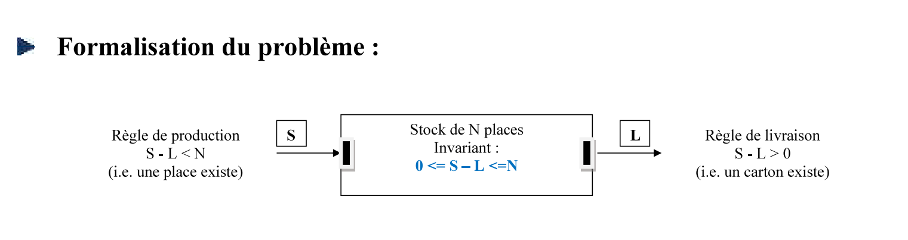
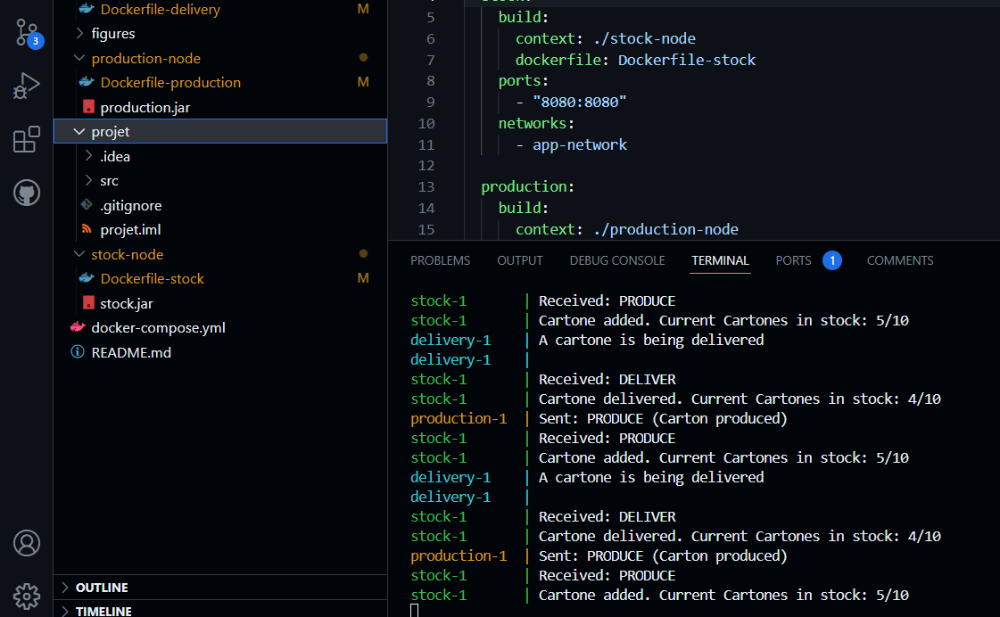

### Project Description

This repository provides a simple simulation of a distributed system **(DS)** focusing on the **modeling of input/output (I/O) operations** for stock management. The goal is not to build a real stock management system, but rather to demonstrate how system components **(represented by Docker containers)** communicate and **exchange** messages in a distributed environment.

The project uses **Java** to handle the communication between containers, simulating the process of sending and receiving messages, and **Docker** to isolate and manage the different nodes of the system. This model helps to visualize and understand the flow of messages within a distributed system and how nodes interact in such an environment.

#### Key Features:

- Simple simulation of distributed system communication
- Java for simulating message exchange (send/receive)
- Docker containers representing system nodes and components
- Visualization of message flow in a distributed system

> This <b>project</b> serves as a foundational demonstration of distributed systems concepts using modern tools like Docker and Java for communication and modeling.
---

#### Flow illustration:

#### Project Execution:

After running `docker-compose up`, Docker will build the necessary images for the Stock, Production, and Delivery nodes, and create containers based on those images. Once the containers are up and running, they begin interacting with each other.

The `production` container continuously sends `PRODUCE` messages to the `stock` container, signaling the addition of new cartons to the stock. At the same time, the `delivery` container sends `DELIVER` messages to the `stock` container, requesting cartons for delivery.

The terminal output will show a log of the messages being sent and received between the containers. For example, the log displays the stock receiving cartons from production and delivering cartons based on the delivery requests. The stock level is adjusted accordingly after each operation, and the interaction continues in a loop.

Here is an illustration of the project execution:

